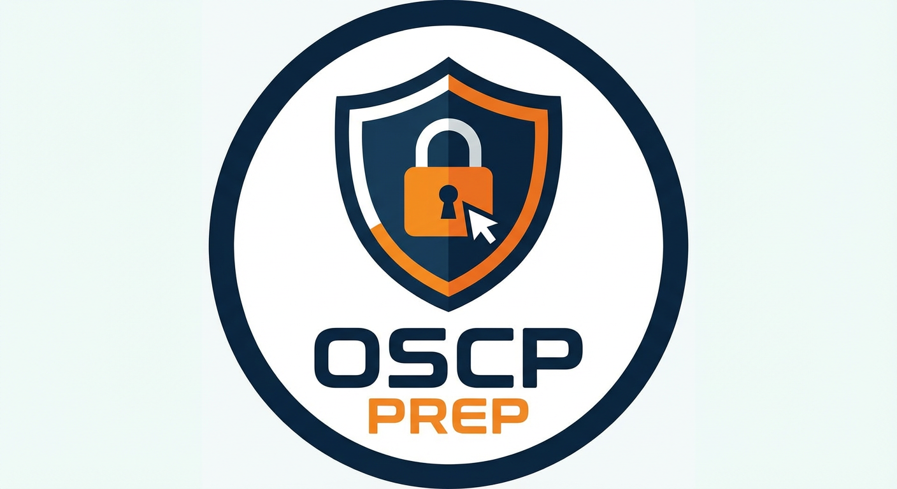

<p align="center">
  
</p>

# OSCP-Prep

Personal preparation repository for the **OSCP** (Offensive Security Certified Professional) certification.

## Content

This repo contains my notes, flowcharts, cheatsheets and methodology built during my OSCP preparation.

### Flowcharts

Visual decision-tree flowcharts for enumeration and exploitation, organized by protocol/service:

- **SMB** - SMB enumeration & exploitation with Metasploit

> **Note:** SVG flowcharts may not render well directly on GitHub due to their size. Click on the file then use the **"Raw"** button to view them in full resolution.

### Cheatsheets

Quick reference guides for fast lookup during engagements:

- **[SMB Enumeration](CHEATSHEETS/SMB_Enumeration_Cheatsheet.md)** - Complete SMB enumeration commands and techniques
- **[Kerberos Attacks](CHEATSHEETS/Kerberos_Attacks_Cheatsheet.md)** - AS-REP Roasting, Kerberoasting, Golden/Silver Tickets, Delegation attacks

## Structure

```
FLOWCHARTS/
  └── SMB/
      ├── MANUAL/
      │   └── SMB_Enumeration_CLI_Flowchart.svg
      └── METASPLOIT/
          └── SMB_Enumeration_Metasploit_Flowchart.svg

CHEATSHEETS/
  ├── SMB_Enumeration_Cheatsheet.md
  └── Kerberos_Attacks_Cheatsheet.md
```

## Disclaimer

This repository is for **educational purposes only**, as part of OSCP certification preparation. All techniques documented here should only be used in authorized environments (labs, CTFs, pentesting engagements with written permission).
